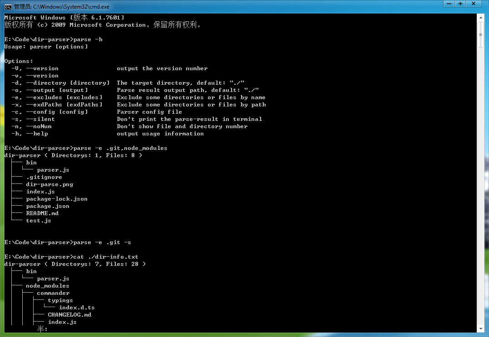

# Dir Parser

Parse a directory and generate it's structure tree.

## Quick Start

### Demo Image



### Install dir-parser

> $ npm install dir-parser -g

### Get help

> $ parse -h
```
Usage: index [options]
Options:
  -V, --version                output the version number
  -v, --version
  -d, --directory [directory]  The target directory, default: "./"
  -o, --output [output]        Parse result output path, default: "./"
  -e, --excludes [excludes]    Exclude some directories or files by name
  -x, --exdPaths [exdPaths]    Exclude some directories or files by path
  -c, --config [config]        Parser config file
  -s, --silent                 Don't print the parse-result in terminal
  -n, --noNum                  Don't show file and directory number
  -h, --help                   output usage information
```

### Parse your dir

> $ cd your/demo/app<br>
> $ parse
```
app ( Directorys: 7, Files: 9 )
 ├─ bin
 │ └─ www
 ├─ public
 │ ├─ images
 │ ├─ javascripts
 │ └─ stylesheets
 │   └─ style.css
 ├─ routes
 │ ├─ index.js
 │ └─ users.js
 ├─ views
 │ ├─ error.jade
 │ ├─ index.jade
 │ └─ layout.jade
 ├─ app.js
 └─ package.json
```
### Parse your dir with params

> $ parse -e bin,public -n -s<br>
> $ cat dir-info.txt
```
app
 ├─ routes
 │ ├─ index.js
 │ └─ users.js
 ├─ views
 │ ├─ error.jade
 │ ├─ index.jade
 │ └─ layout.jade
 ├─ app.js
 └─ package.json
```

### Recommend usages

Usage 01
*There should no white space in the excludes series!*
> $ parse -e .git,node_modules -x bin/www

Usage 02
*There should no white space in the excludes Array!*
> $ parse -e ['.git','node_modules']  -x ['bin/www']

Usage 03
*Parse by a config file*
> $ vi parser.conf.json
```
{
  "directory": "your/demo/app",
  "output": "your/output/dir",
  "excludes": [ ".git", "node_modules" ]
}
```
> $ parse -c ./parser.conf.json

### Use dir-parser in javaScript code

> $ npm install dir-parse funclib<br>
> $ vi test.js
```
  const fn = require('funclib');
  const parse = require('dir-parser');

  /**
  * Get parsed dir-tree
  * ============================================================
  */
  parse('./', { excludes: ['.git', 'dir-info.txt', 'package-lock.json'] }).then(parsed => {

    fn.log(parsed.dirTree, '# parsed.dirTree');
    fn.log(fn.pick(parsed, prop => prop !== 'dirTree'), '# parsed result info');
    // fn.log(parsed.children, '# parsed.children');
    // fn.log(parsed.files, '# parsed.files');

  });
  
  /**
  * Get parsed dir-info (children & files)
  * ============================================================
  */
  parse('./', {

    excludes: [
      '.git', 'node_modules', 'dir-info.txt', 'package-lock.json'
    ],
    files: true,       // Default is false, If true, returns will conatins an array of all subfiles's info;
    children: true,    // Default is false, If true, returns will conatins an object of all children's info;
    dirTree: false     // Default is true, returns will conatins a tree of the directory;

  }).then(parsed => {

    fn.log(parsed.children, '# parsed.children');
    fn.log(parsed.files, '# parsed.files');

  });
```
> $ node test.js
```
==================================================================
                  [17:06:57] # parsed.dirTree
------------------------------------------------------------------
dir-parser ( Directorys: 8, Files: 30 )
 ├─ bin
 │ └─ parser.js
 ├─ node_modules
 │ ├─ commander
 │ │ ├─ typings
 │ │ │ └─ index.d.ts
 │ │ ├─ CHANGELOG.md
 │ │ ├─ index.js
 │ │ ├─ LICENSE
 │ │ ├─ package.json
 │ │ └─ Readme.md
 │ ├─ funclib
 │ │ ├─ funclib.core.js
 │ │ ├─ funclib.js
 │ │ ├─ funclib.min.js
 │ │ ├─ index.d.ts
 │ │ ├─ index.js
 │ │ ├─ package.json
 │ │ └─ README.md
 │ └─ progress
 │   ├─ lib
 │   │ └─ node-progress.js
 │   ├─ CHANGELOG.md
 │   ├─ index.js
 │   ├─ LICENSE
 │   ├─ Makefile
 │   ├─ package.json
 │   └─ Readme.md
 ├─ src
 │ ├─ base.js
 │ └─ dir-parser.js
 ├─ .gitignore
 ├─ dir-parser.png
 ├─ index.js
 ├─ package.json
 ├─ parse.conf.json
 ├─ README.md
 └─ test.js
==================================================================


==================================================================
                [17:06:57] # parsed result info
------------------------------------------------------------------
{
  "name": "dir-parser",
  "type": "directory",
  "path": "./",
  "absPath": "E:\\work\\code\\dir-parser",
  "dir": ".",
  "absDir": "E:\\work\\code",
  "dirNum": 8,
  "fileNum": 30
}
==================================================================


==================================================================
                  [17:06:57] # parsed.children
------------------------------------------------------------------
[
  {
    "name": "bin",
    "type": "directory",
    "size": 2920,
    "size_kb": "2.85kb",
    "path": "bin",
    "absPath": "E:\\work\\code\\dir-parser\\bin",
    "dir": ".",
    "absDir": "E:\\work\\code\\dir-parser",
    "dirNum": 0,
    "fileNum": 1,
    "children": [
      {
        "name": "parser.js",
        "base": "parser",
        "ext": ".js",
        "type": "file",
        "size": 2920,
        "size_kb": "2.85kb",
        "path": "bin\\parser.js",
        "absPath": "E:\\work\\code\\dir-parser\\bin\\parser.js",
        "dir": "bin",
        "absDir": "E:\\work\\code\\dir-parser\\bin"
      }
    ]
  },
  {
    "name": "src",
    "type": "directory",
    "size": 6488,
    "size_kb": "6.34kb",
    "path": "src",
    "absPath": "E:\\work\\code\\dir-parser\\src",
    "dir": ".",
    "absDir": "E:\\work\\code\\dir-parser",
    "dirNum": 0,
    "fileNum": 2,
    "children": [
      {
        "name": "base.js",
        "base": "base",
        "ext": ".js",
        "type": "file",
        "size": 1038,
        "size_kb": "1.01kb",
        "path": "src\\base.js",
        "absPath": "E:\\work\\code\\dir-parser\\src\\base.js",
        "dir": "src",
        "absDir": "E:\\work\\code\\dir-parser\\src"
      },
      {
        "name": "dir-parser.js",
        "base": "dir-parser",
        "ext": ".js",
        "type": "file",
        "size": 5450,
        "size_kb": "5.32kb",
        "path": "src\\dir-parser.js",
        "absPath": "E:\\work\\code\\dir-parser\\src\\dir-parser.js",
        "dir": "src",
        "absDir": "E:\\work\\code\\dir-parser\\src"
      }
    ]
  },
  {
    "name": ".gitignore",
    "base": ".gitignore",
    "ext": "",
    "type": "file",
    "size": 34,
    "size_kb": "0.03kb",
    "path": ".gitignore",
    "absPath": "E:\\work\\code\\dir-parser\\.gitignore",
    "dir": "",
    "absDir": "E:\\work\\code\\dir-parser"
  },
  {
    "name": "dir-parser.png",
    "base": "dir-parser",
    "ext": ".png",
    "type": "file",
    "size": 76316,
    "size_kb": "74.53kb",
    "path": "dir-parser.png",
    "absPath": "E:\\work\\code\\dir-parser\\dir-parser.png",
    "dir": "",
    "absDir": "E:\\work\\code\\dir-parser"
  },
  {
    "name": "index.js",
    "base": "index",
    "ext": ".js",
    "type": "file",
    "size": 45,
    "size_kb": "0.04kb",
    "path": "index.js",
    "absPath": "E:\\work\\code\\dir-parser\\index.js",
    "dir": "",
    "absDir": "E:\\work\\code\\dir-parser"
  },
  {
    "name": "package.json",
    "base": "package",
    "ext": ".json",
    "type": "file",
    "size": 732,
    "size_kb": "0.71kb",
    "path": "package.json",
    "absPath": "E:\\work\\code\\dir-parser\\package.json",
    "dir": "",
    "absDir": "E:\\work\\code\\dir-parser"
  },
  {
    "name": "parse.conf.json",
    "base": "parse.conf",
    "ext": ".json",
    "type": "file",
    "size": 111,
    "size_kb": "0.11kb",
    "path": "parse.conf.json",
    "absPath": "E:\\work\\code\\dir-parser\\parse.conf.json",
    "dir": "",
    "absDir": "E:\\work\\code\\dir-parser"
  },
  {
    "name": "README.md",
    "base": "README",
    "ext": ".md",
    "type": "file",
    "size": 11467,
    "size_kb": "11.2kb",
    "path": "README.md",
    "absPath": "E:\\work\\code\\dir-parser\\README.md",
    "dir": "",
    "absDir": "E:\\work\\code\\dir-parser"
  },
  {
    "name": "test.js",
    "base": "test",
    "ext": ".js",
    "type": "file",
    "size": 1196,
    "size_kb": "1.17kb",
    "path": "test.js",
    "absPath": "E:\\work\\code\\dir-parser\\test.js",
    "dir": "",
    "absDir": "E:\\work\\code\\dir-parser"
  }
]
==================================================================


==================================================================
                   [17:06:57] # parsed.files
------------------------------------------------------------------
[
  {
    "name": "parser.js",
    "base": "parser",
    "ext": ".js",
    "type": "file",
    "size": 2920,
    "size_kb": "2.85kb",
    "path": "bin\\parser.js",
    "absPath": "E:\\work\\code\\dir-parser\\bin\\parser.js",
    "dir": "bin",
    "absDir": "E:\\work\\code\\dir-parser\\bin"
  },
  {
    "name": "base.js",
    "base": "base",
    "ext": ".js",
    "type": "file",
    "size": 1038,
    "size_kb": "1.01kb",
    "path": "src\\base.js",
    "absPath": "E:\\work\\code\\dir-parser\\src\\base.js",
    "dir": "src",
    "absDir": "E:\\work\\code\\dir-parser\\src"
  },
  {
    "name": "dir-parser.js",
    "base": "dir-parser",
    "ext": ".js",
    "type": "file",
    "size": 5450,
    "size_kb": "5.32kb",
    "path": "src\\dir-parser.js",
    "absPath": "E:\\work\\code\\dir-parser\\src\\dir-parser.js",
    "dir": "src",
    "absDir": "E:\\work\\code\\dir-parser\\src"
  },
  {
    "name": ".gitignore",
    "base": ".gitignore",
    "ext": "",
    "type": "file",
    "size": 34,
    "size_kb": "0.03kb",
    "path": ".gitignore",
    "absPath": "E:\\work\\code\\dir-parser\\.gitignore",
    "dir": "",
    "absDir": "E:\\work\\code\\dir-parser"
  },
  {
    "name": "dir-parser.png",
    "base": "dir-parser",
    "ext": ".png",
    "type": "file",
    "size": 76316,
    "size_kb": "74.53kb",
    "path": "dir-parser.png",
    "absPath": "E:\\work\\code\\dir-parser\\dir-parser.png",
    "dir": "",
    "absDir": "E:\\work\\code\\dir-parser"
  },
  {
    "name": "index.js",
    "base": "index",
    "ext": ".js",
    "type": "file",
    "size": 45,
    "size_kb": "0.04kb",
    "path": "index.js",
    "absPath": "E:\\work\\code\\dir-parser\\index.js",
    "dir": "",
    "absDir": "E:\\work\\code\\dir-parser"
  },
  {
    "name": "package.json",
    "base": "package",
    "ext": ".json",
    "type": "file",
    "size": 732,
    "size_kb": "0.71kb",
    "path": "package.json",
    "absPath": "E:\\work\\code\\dir-parser\\package.json",
    "dir": "",
    "absDir": "E:\\work\\code\\dir-parser"
  },
  {
    "name": "parse.conf.json",
    "base": "parse.conf",
    "ext": ".json",
    "type": "file",
    "size": 111,
    "size_kb": "0.11kb",
    "path": "parse.conf.json",
    "absPath": "E:\\work\\code\\dir-parser\\parse.conf.json",
    "dir": "",
    "absDir": "E:\\work\\code\\dir-parser"
  },
  {
    "name": "README.md",
    "base": "README",
    "ext": ".md",
    "type": "file",
    "size": 11467,
    "size_kb": "11.2kb",
    "path": "README.md",
    "absPath": "E:\\work\\code\\dir-parser\\README.md",
    "dir": "",
    "absDir": "E:\\work\\code\\dir-parser"
  },
  {
    "name": "test.js",
    "base": "test",
    "ext": ".js",
    "type": "file",
    "size": 1196,
    "size_kb": "1.17kb",
    "path": "test.js",
    "absPath": "E:\\work\\code\\dir-parser\\test.js",
    "dir": "",
    "absDir": "E:\\work\\code\\dir-parser"
  }
]
==================================================================
```