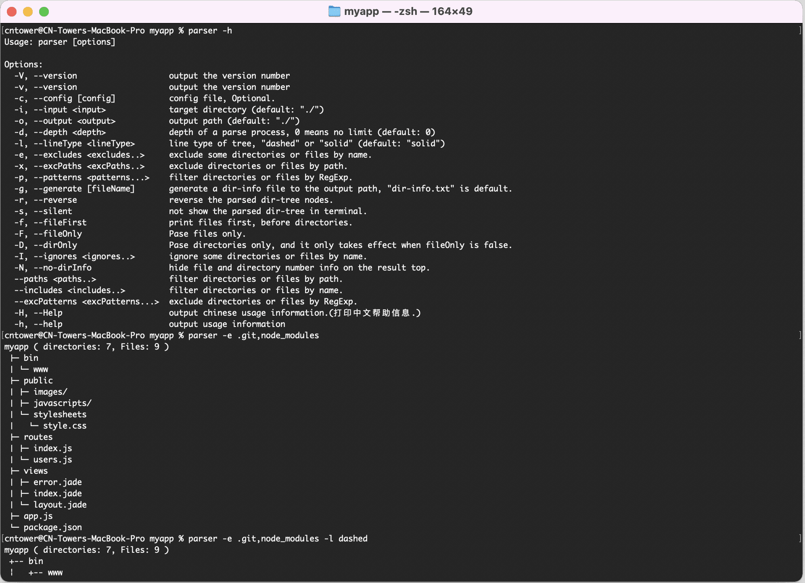

# dir-parser

[](https://www.npmjs.com/package/dir-parser)
[](https://www.npmjs.com/package/dir-parser) 
[](https://npmcharts.com/compare/dir-parser?minimal=true)
[](https://packagephobia.now.sh/result?p=dir-parser)

> Parse a directory and generate it's structure tree.

Read this in other languages: English | [简体中文](./README_zh-CN.md)

- [dir-parser](#dir-parser)
  - [1. What is dir-parser](#1-what-is-dir-parser)
    - [1.1 Brief introduce](#11-brief-introduce)
    - [1.2 Installation](#12-installation)
  - [2. Command Line](#2-command-line)
    - [2.1 Print help info](#21-print-help-info)
    - [2.2 Generate dir-tree](#22-generate-dir-tree)
    - [2.3 With parameters](#23-with-parameters)
  - [3. In JavaScript](#3-in-javascript)
    - [3.1 Interface](#31-interface)
    - [3.2 Get dir-tree](#32-get-dir-tree)
    - [3.3 Get dir-info](#33-get-dir-info)

## 1. What is dir-parser

### 1.1 Brief introduce

<p align="center">
  
</p>

Dir parser is a powerful folder analysis tool based on nodejs, which can be used in command line or JavaScript code. There are many practical parameters that can be set to help you get the formatted folder tree and internal information.

### 1.2 Installation

#### 1.2.1 Global install
- yarn: `$ yarn global add dir-parser`
- npm: `$ npm install -g dir-parser`

#### 1.2.2 Local install
- yarn: `$ yarn add dir-parser` or `$ yarn add dir-parser -D`
- npm: `$ npm install dir-parser` or `$ npm install dir-parser -D`

## 2. Command Line

### 2,1 Print help info
`$ parser -h` (or: `$ parser --help`)
```
Usage: parser [options]

Options:
  -V, --version                   output the version number
  -v, --version                   output the version number
  -c, --config [config]           config file, Optional.
  -i, --input <input>             target directory (default: "./")
  -o, --output <output>           output path (default: "./")
  -d, --depth <depth>             depth of a parse process, 0 means no limit (default: 0)
  -l, --lineType <lineType>       line type of tree, "dashed" or "solid" (default: "solid")
  -e, --excludes <excludes..>     exclude some directories or files by name.
  -x, --excPaths <excPaths..>     exclude directories or files by path.
  -p, --patterns <patterns...>    filter directories or files by RegExp.
  -g, --generate [fileName]       generate a dir-info file to the output path, "dir-info.txt" is default.
  -r, --reverse                   reverse the parsed dir-tree nodes.
  -s, --silent                    not show the parsed dir-tree in terminal.
  -f, --fileFirst                 print files first, before directories.
  -F, --fileOnly                  Pase files only.
  -D, --dirOnly                   Pase directories only, and it only takes effect when fileOnly is false.
  -I, --ignores <ignores..>       ignore some directories or files by name.
  -N, --no-dirInfo                hide file and directory number info on the result top.
  --paths <paths..>               filter directories or files by path.
  --includes <includes..>         filter directories or files by name.
  --excPatterns <excPatterns...>  exclude directories or files by RegExp.
  -h, --help                      output usage information
```

### 2.2 Generate dir-tree
To run demo, you need to install `express-generator`:<br>
Run: <br>
`$ npm install -g express-generator`<br>
`$ express myapp`<br>
`$ cd myapp`<br>
`$ parser`<br>
```
myapp ( directories: 7, Files: 9 )
 ├─ bin
 │ └─ www
 ├─ public
 │ ├─ images/
 │ ├─ javascripts/
 │ └─ stylesheets
 │   └─ style.css
 ├─ routes
 │ ├─ index.js
 │ └─ users.js
 ├─ views
 │ ├─ error.jade
 │ ├─ index.jade
 │ └─ layout.jade
 ├─ app.js
 └─ package.json
```

### 2.3 With parameters

#### 2.3.1 excludes
exclude some directories or files by name.<br>
`$ # git init`<br>
`$ npm install`<br>
`$ parser -e .git,node_modules,public` (or: `$ parser --excludes .git,node_modules,public`)
```
myapp ( directories: 3, Files: 8 )
 ├─ bin
 │ └─ www
 ├─ routes
 │ ├─ index.js
 │ └─ users.js
 ├─ views
 │ ├─ error.jade
 │ ├─ index.jade
 │ └─ layout.jade
 ├─ app.js
 └─ package.json
```

#### 2.3.1 ignores
ignore some directories or files by name.<br>
`$ parser -e node_modules -I bin,public` (or: `$ parser -e node_modules --ignores bin,public`)
```
myapp ( directories: 4, Files: 7 )
 ├─ bin/
 ├─ public/
 ├─ routes
 │ ├─ index.js
 │ └─ users.js
 ├─ views
 │ ├─ error.jade
 │ ├─ index.jade
 │ └─ layout.jade
 ├─ app.js
 └─ package.json
```

#### 2.3.2 patterns
filter directories or files by RegExp.<br>
`$ parser -e node_modules -p .js$` (or: `parser -e node_modules --patterns .js$`)
```
myapp ( directories: 1, Files: 3 )
 ├─ routes
 │ ├─ index.js
 │ └─ users.js
 └─ app.js
```

#### 2.3.3 lineType
line type of tree, "dashed" or "solid" (default: "solid")<br>
`$ parser -e bin,node_modules -l dashed` (or: `$ parser -e bin,node_modules --lineType dashed`)
```
myapp ( directories: 6, Files: 8 )
 +-- public
 ¦   +-- images/
 ¦   +-- javascripts/
 ¦   +-- stylesheets
 ¦       +-- style.css
 +-- routes
 ¦   +-- index.js
 ¦   +-- users.js
 +-- views
 ¦   +-- error.jade
 ¦   +-- index.jade
 ¦   +-- layout.jade
 +-- app.js
 +-- package.json
```

#### 2.3.2 depth
depth of a parse process, 0 means no limit (default: 0)<br>
`$ parser -e node_modules,views -d 2` (or: `parser -e node_modules,views --depth 2`)
```
myapp ( directories: 6, Files: 5 )
 ├─ bin
 │ └─ www
 ├─ public
 │ ├─ images/
 │ ├─ javascripts/
 │ └─ stylesheets/*
 ├─ routes
 │ ├─ index.js
 │ └─ users.js
 ├─ app.js
 └─ package.json
```

#### 2.3.2 reverse
reverse the parsed dir-tree nodes.<br>
`$ parser -e node_modules,views -d 2 -r` (or: `parser -e node_modules,views -d 2 --reverse`)
```
myapp ( directories: 6, Files: 5 )
 ├─ routes
 │ ├─ users.js
 │ └─ index.js
 ├─ public
 │ ├─ stylesheets/*
 │ ├─ javascripts/
 │ └─ images/
 ├─ bin
 │ └─ www
 ├─ package.json
 └─ app.js
```

#### 2.3.2 fileFirst
print files first, before directories.<br>
`$ parser -e node_modules,bin,views -f` (or: `parser -e node_modules,bin,views --fileFirst`)
```
myapp ( directories: 5, Files: 6 )
 ├─ app.js
 ├─ dir-info.txt
 ├─ package.json
 ├─ public
 │ ├─ images/
 │ ├─ javascripts/
 │ └─ stylesheets
 │   └─ style.css
 └─ routes
   ├─ index.js
   └─ users.js
```

#### 2.3.2 fileOnly
Pase files only.<br>
`$ parser -e node_modules,bin,views -F` (or: `parser -e node_modules,bin,views --fileOnly`)
```
myapp ( directories: 3, Files: 6 )
 ├─ public
 │ └─ stylesheets
 │   └─ style.css
 ├─ routes
 │ ├─ index.js
 │ └─ users.js
 ├─ app.js
 ├─ dir-info.txt
 └─ package.json
```

#### 2.3.2 dirOnly
Pase directories only, and it only takes effect when fileOnly is false.<br>
`$ parser -e node_modules,bin,views -D` (or: `parser -e node_modules,bin,views --dirOnly`)
```
myapp ( directories: 5 )
 ├─ public
 │ ├─ images/
 │ ├─ javascripts/
 │ └─ stylesheets/
 └─ routes/
```

#### 2.3.3 dirInfo
hide file and directory number info on the result top.<br>
`$ parser -e node_modules,bin,public -N` (or: `$ parser -e node_modules,bin,public --no-dirInfo`)
```
myapp
 ├─ routes
 │ ├─ index.js
 │ └─ users.js
 ├─ views
 │ ├─ error.jade
 │ ├─ index.jade
 │ └─ layout.jade
 ├─ app.js
 ├─ dir-info.txt
 └─ package.json
```

#### 2.3.3 excPaths
exclude directories or files by path.<br>
`$ parser -e node_modules,bin -x myapp/public` (or: `$ parser -e node_modules,bin -excPath myapp/public`)
```
myapp ( directories: 2, Files: 7 )
 ├─ routes
 │ ├─ index.js
 │ └─ users.js
 ├─ views
 │ ├─ error.jade
 │ ├─ index.jade
 │ └─ layout.jade
 ├─ app.js
 └─ package.json
```

#### 2.3.3 excPatterns
exclude directories or files by RegExp.<br>
`$ parser -e node_modules,bin --excPatterns .jade$,.css$`
```
myapp ( directories: 6, Files: 4 )
 ├─ public
 │ ├─ images/
 │ ├─ javascripts/
 │ └─ stylesheets/
 ├─ routes
 │ ├─ index.js
 │ └─ users.js
 ├─ views/
 ├─ app.js
 └─ package.json
```

#### 2.3.3 silent
not show the parsed dir-tree in terminal.<br>
`$ parser -e node_modules,bin,public -s` (or: `$ parser -e node_modules,bin,public --silent`)

#### 2.3.3 generate
generate a dir-info file to the output path, "dir-info.txt" is default.<br>
`$ parser -e node_modules,bin,public -sg` (or: `$ parser -e node_modules,bin,public -s --generate`)<br>
`$ cat dir-info.txt`
```
myapp ( directories: 2, Files: 7 )
 ├─ routes
 │ ├─ index.js
 │ └─ users.js
 ├─ views
 │ ├─ error.jade
 │ ├─ index.jade
 │ └─ layout.jade
 ├─ app.js
 └─ package.json
```

#### 2.3.3 config
config file, Optional.<br>
`$ vi parser.conf.json`
```json
{
  "directory": "./",
  "excludes": [ ".git", "node_modules", "bin", "public", "parser.conf.json" ],
  "depth": "2",
  "generate": "info.txt"
}
```
`$ parser -c ./parser.conf.json`
```
myapp ( directories: 2, Files: 8 )
 ├─ routes
 │ ├─ index.js
 │ └─ users.js
 ├─ views
 │ ├─ error.jade
 │ ├─ index.jade
 │ └─ layout.jade
 ├─ app.js
 ├─ dir-info.txt
 └─ package.json
```

## 3. In JavaScript
### 3.1 Interfaces
#### 3.1.1 Main Function
```ts
parser(dirPath: string, options: Options): Promise<Parsed>
```
#### 3.1.2 Options
```ts
interface options {             
  depth?: number;
  reverse?: boolean;
  fileFirst?: boolean;
  fileOnly?: boolean;
  dirOnly?: boolean;
  getFiles?: boolean;
  getChildren?: boolean;
  dirTree?: boolean;             // default: true
  dirInfo?: boolean;             // default: true
  lineType?: 'solid' | 'dashed'; // default: 'solid'
  excludes?: Array<string>;      // eg: [ '.git', 'node_modules', '.idea' ];
  excPaths?: Array<string>;      // eg: [ 'src/app' ];
  excPatterns?: Array<string>;   // eg: [ 'src/*.js ]';
  ignores: Array<string>;        // eg: [ 'public' ];
  includes: Array<string>;       // eg: [ 'app.js' ];
  paths?: Array<string>;         // eg: [ 'src/public' ];
  patterns?: Array<string>;      // eg: [ '*.js ]';
}
```
#### 3.1.3 Parsed Result
```ts
interface Parsed extends DirInfo {
  dirTree: string;
  children: Array<DirInfo | FileInfo>
  files: Array<FileInfo>
}
```
#### 3.1.4 Directory Info
```ts
interface DirInfo {
  name: string;
  type: 'directory';
  size: number;
  size_kb: number;
  path: string;
  absPath: string;
  dir: string;
  absDir: string;
  dirNum: number;
  fileNum: number;
  children: Array<DirInfo | FileInfo>
}
```
#### 3.1.4 File Info
```ts
interface FileInfo {
  name: string;
  base: string;
  ext: string;
  type: 'file';
  size: number;
  size_kb: number;
  path: string;
  absPath: string;
  dir: string;
  absDir: string;
}
```

### 3.2 Get dir-tree


#### 1.2.3 Install demo dependencies

`$ vi test.js`
```js
const fn = require('funclib');
const parser = require('dir-parser');
// excludes list
const excludes = ['.git', 'node_modules', 'dir-info.txt', 'package-lock.json'];
```

##### Generate dir Tree
`$ vi test.js`
```js
parser('./', {
  excludes: excludes,
  // lineType: 'dashed',
  // fileFirst: true,
}).then(parsed => {
  fn.log(parsed.dirTree, '# parsed.dirTree');

  // fn.log(fn.pick(parsed, prop => prop !== 'dirTree'), '# parsed result info');
  // fn.log(parsed.children, '# parsed.children');
  // fn.log(parsed.files, '# parsed.files');
});
```
*Execute example:* `$ node test.js`
```
==================================================================
                  [17:06:57] # parsed.dirTree
------------------------------------------------------------------
dir-parser ( directories: 8, Files: 30 )
 ├─ bin
 │ └─ parser.js
 ├─ node_modules
 │ ├─ commander
 │ │ ├─ typings
 │ │ │ └─ index.d.ts
 │ │ ├─ CHANGELOG.md
 │ │ ├─ index.js
 │ │ ├─ LICENSE
 │ │ ├─ package.json
 │ │ └─ Readme.md
 │ ├─ funclib
 │ │ ├─ funclib.core.js
 │ │ ├─ funclib.js
 │ │ ├─ funclib.min.js
 │ │ ├─ index.d.ts
 │ │ ├─ index.js
 │ │ ├─ package.json
 │ │ └─ README.md
 │ └─ progress
 │   ├─ lib
 │   │ └─ node-progress.js
 │   ├─ CHANGELOG.md
 │   ├─ index.js
 │   ├─ LICENSE
 │   ├─ Makefile
 │   ├─ package.json
 │   └─ Readme.md
 ├─ src
 │ ├─ base.js
 │ └─ dir-parser.js
 ├─ .gitignore
 ├─ dir-parser.png
 ├─ index.js
 ├─ package.json
 ├─ parser.conf.json
 ├─ README.md
 └─ test.js
==================================================================
```
#### 3.3 Get dir-info
`$ vi test.js`
```
parser('./', {
  excludes: excludes,
  // lineType: 'dashed',
  // fileFirst: true,
}).then(parsed => {
  fn.log(fn.pick(parsed, prop => prop !== 'dirTree'), '# parsed result info');
  
  // fn.log(parsed.dirTree, '# parsed.dirTree');
  // fn.log(parsed.children, '# parsed.children');
  // fn.log(parsed.files, '# parsed.files');
});
```
*Execute example:* `$ node test.js`
```
==================================================================
                [17:06:57] # parsed result info
------------------------------------------------------------------
{
  "name": "dir-parser",
  "type": "directory",
  "path": "./",
  "absPath": "E:\\work\\code\\dir-parser",
  "dir": ".",
  "absDir": "E:\\work\\code",
  "dirNum": 8,
  "fileNum": 30
}
==================================================================
```
##### Get directory json
`$ vi test.js`
```
parser('./', {
  excludes: excludes,
  getFiles: true,    // Default is false, If true, returns will conatins an array of all subfiles's info;
  getChildren: true, // Default is false, If true, returns will conatins an object of all children's info;
  dirTree: false     // Default is true, returns will conatins a tree of the directory;
}).then(parsed => {
  fn.log(parsed.children, '# parsed.children');
  // fn.log(parsed.files, '# parsed.files');
});
```
*Execute example:* `$ node test.js`
```
==================================================================
                  [17:06:57] # parsed.children
------------------------------------------------------------------
[
  {
    "name": "bin",
    "type": "directory",
    "size": 2920,
    "size_kb": "2.85kb",
    "path": "bin",
    "absPath": "E:\\work\\code\\dir-parser\\bin",
    "dir": ".",
    "absDir": "E:\\work\\code\\dir-parser",
    "dirNum": 0,
    "fileNum": 1,
    "children": [
      {
        "name": "parser.js",
        "base": "parser",
        "ext": ".js",
        "type": "file",
        "size": 2920,
        "size_kb": "2.85kb",
        "path": "bin\\parser.js",
        "absPath": "E:\\work\\code\\dir-parser\\bin\\parser.js",
        "dir": "bin",
        "absDir": "E:\\work\\code\\dir-parser\\bin"
      }
    ]
  },
  {
    "name": "src",
    "type": "directory",
    "size": 6488,
    "size_kb": "6.34kb",
    "path": "src",
    "absPath": "E:\\work\\code\\dir-parser\\src",
    "dir": ".",
    "absDir": "E:\\work\\code\\dir-parser",
    "dirNum": 0,
    "fileNum": 2,
    "children": [
      {
        "name": "base.js",
        "base": "base",
        "ext": ".js",
        "type": "file",
        "size": 1038,
        "size_kb": "1.01kb",
        "path": "src\\base.js",
        "absPath": "E:\\work\\code\\dir-parser\\src\\base.js",
        "dir": "src",
        "absDir": "E:\\work\\code\\dir-parser\\src"
      },
      {
        "name": "dir-parser.js",
        "base": "dir-parser",
        "ext": ".js",
        "type": "file",
        "size": 5450,
        "size_kb": "5.32kb",
        "path": "src\\dir-parser.js",
        "absPath": "E:\\work\\code\\dir-parser\\src\\dir-parser.js",
        "dir": "src",
        "absDir": "E:\\work\\code\\dir-parser\\src"
      }
    ]
  },
  {
    "name": ".gitignore",
    "base": ".gitignore",
    "ext": "",
    "type": "file",
    "size": 34,
    "size_kb": "0.03kb",
    "path": ".gitignore",
    "absPath": "E:\\work\\code\\dir-parser\\.gitignore",
    "dir": "",
    "absDir": "E:\\work\\code\\dir-parser"
  },
  {
    "name": "dir-parser.png",
    "base": "dir-parser",
    "ext": ".png",
    "type": "file",
    "size": 76316,
    "size_kb": "74.53kb",
    "path": "dir-parser.png",
    "absPath": "E:\\work\\code\\dir-parser\\dir-parser.png",
    "dir": "",
    "absDir": "E:\\work\\code\\dir-parser"
  },
  {
    "name": "index.js",
    "base": "index",
    "ext": ".js",
    "type": "file",
    "size": 45,
    "size_kb": "0.04kb",
    "path": "index.js",
    "absPath": "E:\\work\\code\\dir-parser\\index.js",
    "dir": "",
    "absDir": "E:\\work\\code\\dir-parser"
  },
  {
    "name": "package.json",
    "base": "package",
    "ext": ".json",
    "type": "file",
    "size": 732,
    "size_kb": "0.71kb",
    "path": "package.json",
    "absPath": "E:\\work\\code\\dir-parser\\package.json",
    "dir": "",
    "absDir": "E:\\work\\code\\dir-parser"
  },
  {
    "name": "parser.conf.json",
    "base": "parser.conf",
    "ext": ".json",
    "type": "file",
    "size": 111,
    "size_kb": "0.11kb",
    "path": "parser.conf.json",
    "absPath": "E:\\work\\code\\dir-parser\\parser.conf.json",
    "dir": "",
    "absDir": "E:\\work\\code\\dir-parser"
  },
  {
    "name": "README.md",
    "base": "README",
    "ext": ".md",
    "type": "file",
    "size": 11467,
    "size_kb": "11.2kb",
    "path": "README.md",
    "absPath": "E:\\work\\code\\dir-parser\\README.md",
    "dir": "",
    "absDir": "E:\\work\\code\\dir-parser"
  },
  {
    "name": "test.js",
    "base": "test",
    "ext": ".js",
    "type": "file",
    "size": 1196,
    "size_kb": "1.17kb",
    "path": "test.js",
    "absPath": "E:\\work\\code\\dir-parser\\test.js",
    "dir": "",
    "absDir": "E:\\work\\code\\dir-parser"
  }
]
==================================================================
```
##### Get directory json
`$ vi test.js`
```
parser('./', {
  excludes: excludes,
  getFiles: true,
  getChildren: true,
  dirTree: false
}).then(parsed => {
  // fn.log(parsed.children, '# parsed.children');
  fn.log(parsed.files, '# parsed.files');
});
```
*Execute example:* `$ node test.js`
```
==================================================================
                   [17:06:57] # parsed.files
------------------------------------------------------------------
[
  {
    "name": "parser.js",
    "base": "parser",
    "ext": ".js",
    "type": "file",
    "size": 2920,
    "size_kb": "2.85kb",
    "path": "bin\\parser.js",
    "absPath": "E:\\work\\code\\dir-parser\\bin\\parser.js",
    "dir": "bin",
    "absDir": "E:\\work\\code\\dir-parser\\bin"
  },
  {
    "name": "base.js",
    "base": "base",
    "ext": ".js",
    "type": "file",
    "size": 1038,
    "size_kb": "1.01kb",
    "path": "src\\base.js",
    "absPath": "E:\\work\\code\\dir-parser\\src\\base.js",
    "dir": "src",
    "absDir": "E:\\work\\code\\dir-parser\\src"
  },
  {
    "name": "dir-parser.js",
    "base": "dir-parser",
    "ext": ".js",
    "type": "file",
    "size": 5450,
    "size_kb": "5.32kb",
    "path": "src\\dir-parser.js",
    "absPath": "E:\\work\\code\\dir-parser\\src\\dir-parser.js",
    "dir": "src",
    "absDir": "E:\\work\\code\\dir-parser\\src"
  },
  {
    "name": ".gitignore",
    "base": ".gitignore",
    "ext": "",
    "type": "file",
    "size": 34,
    "size_kb": "0.03kb",
    "path": ".gitignore",
    "absPath": "E:\\work\\code\\dir-parser\\.gitignore",
    "dir": "",
    "absDir": "E:\\work\\code\\dir-parser"
  },
  {
    "name": "dir-parser.png",
    "base": "dir-parser",
    "ext": ".png",
    "type": "file",
    "size": 76316,
    "size_kb": "74.53kb",
    "path": "dir-parser.png",
    "absPath": "E:\\work\\code\\dir-parser\\dir-parser.png",
    "dir": "",
    "absDir": "E:\\work\\code\\dir-parser"
  },
  {
    "name": "index.js",
    "base": "index",
    "ext": ".js",
    "type": "file",
    "size": 45,
    "size_kb": "0.04kb",
    "path": "index.js",
    "absPath": "E:\\work\\code\\dir-parser\\index.js",
    "dir": "",
    "absDir": "E:\\work\\code\\dir-parser"
  },
  {
    "name": "package.json",
    "base": "package",
    "ext": ".json",
    "type": "file",
    "size": 732,
    "size_kb": "0.71kb",
    "path": "package.json",
    "absPath": "E:\\work\\code\\dir-parser\\package.json",
    "dir": "",
    "absDir": "E:\\work\\code\\dir-parser"
  },
  {
    "name": "parser.conf.json",
    "base": "parser.conf",
    "ext": ".json",
    "type": "file",
    "size": 111,
    "size_kb": "0.11kb",
    "path": "parser.conf.json",
    "absPath": "E:\\work\\code\\dir-parser\\parser.conf.json",
    "dir": "",
    "absDir": "E:\\work\\code\\dir-parser"
  },
  {
    "name": "README.md",
    "base": "README",
    "ext": ".md",
    "type": "file",
    "size": 11467,
    "size_kb": "11.2kb",
    "path": "README.md",
    "absPath": "E:\\work\\code\\dir-parser\\README.md",
    "dir": "",
    "absDir": "E:\\work\\code\\dir-parser"
  },
  {
    "name": "test.js",
    "base": "test",
    "ext": ".js",
    "type": "file",
    "size": 1196,
    "size_kb": "1.17kb",
    "path": "test.js",
    "absPath": "E:\\work\\code\\dir-parser\\test.js",
    "dir": "",
    "absDir": "E:\\work\\code\\dir-parser"
  }
]
==================================================================
```
