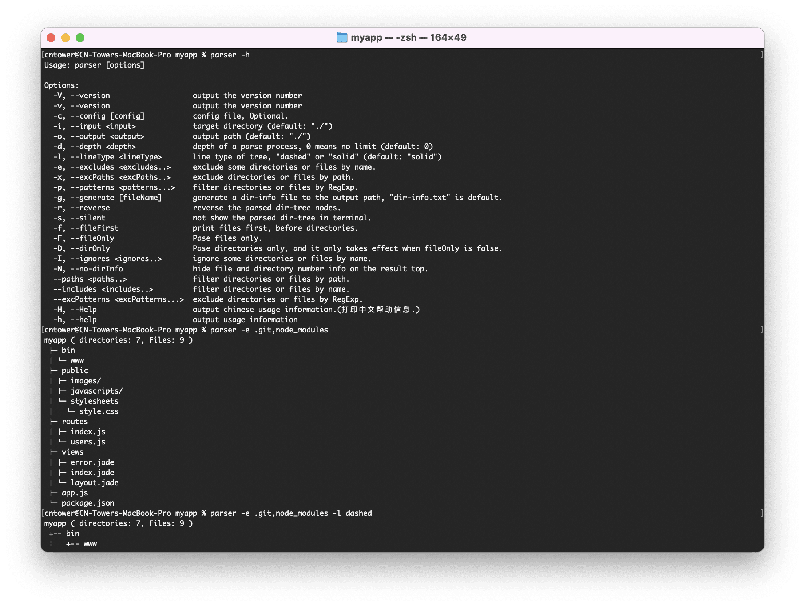

<h1 align="center">😎 文件夹解析器[Dir Parser v2] 😎</h1>
<p align="center">
  
</p>

# 文件夹解析器 dir-parser

[](https://www.npmjs.com/package/dir-parser)
[](https://www.npmjs.com/package/dir-parser) 
[](https://npmcharts.com/compare/dir-parser?minimal=true)
[](https://packagephobia.now.sh/result?p=dir-parser)

> 解析一个文件夹并生成它的结构树

使用其它语言阅读: [English](https://github.com/CN-Tower/dir-parser) | 简体中文

- [文件夹解析器 dir-parser](#文件夹解析器-dir-parser)
  - [一、什么是文件夹解析器 dir-parser](#一什么是文件夹解析器-dir-parser)
    - [1.1 工具简介](#11-工具简介)
    - [1.2 安装使用](#12-安装使用)
  - [二、在命令行中使用](#二在命令行中使用)
    - [2.1 打印帮助信息](#21-打印帮助信息)
    - [2.2 生成文件树](#22-生成文件树)
    - [2.3 使用解析参数](#23-使用解析参数)
      - [2.3.1 排除项-excludes](#231-排除项-excludes)
      - [2.3.2 忽略项-ignores](#232-忽略项-ignores)
      - [2.3.3 正则匹配-patterns](#233-正则匹配-patterns)
      - [2.3.4 结构线型-lineType](#234-结构线型-lineType)
      - [2.3.5 解析深度-depth](#235-解析深度-depth)
      - [2.3.6 节点逆序-reverse](#236-节点逆序-reverse)
      - [2.3.7 文件优先-fileFirst](#237-文件优先-fileFirst)
      - [2.3.8 仅文件-fileOnly](#238-仅文件-fileOnly)
      - [2.3.9 仅文件夹-dirOnly](#239-仅文件夹-dirOnly)
      - [2.3.10 解析信息-dirInfo](#2310-解析信息-dirInfo)
      - [2.3.11 路径排除-excPaths](#2311-路径排除-excPaths)
      - [2.3.12 正则排除-excPatterns](#2312-正则排除-excPatterns)
      - [2.3.13 静默解析-silent](#2313-静默解析-silent)
      - [2.3.14 生成结果-generate](#2314-生成结果-generate)
      - [2.3.15 配置文件-config](#2315-配置文件-config)
    - [2.4 多个命令混合使用](#24-多个命令混合使用)
  - [三、在Js代码中使用](#三在Js代码中使用)
    - [3.1 方法接口](#31-方法接口)
      - [3.1.1 主函数-parser](#311-主函数-parser)
      - [3.1.2 参数选项-Options](#312-参数选项-options)
      - [3.1.3 解析结果-Parsed](#313-解析结果-parsed)
      - [3.1.4 文件夹信息-DirInfo](#314-文件夹信息-dirinfo)
      - [3.1.5 文件信息-FileInfo](#315-文件信息-fileinfo)
    - [3.2 获取文件树](#32-获取文件树)
      - [3.2.1 构建文件树案例](#321-构建文件树案例)
      - [3.2.2 执行文件树案例](#322-执行文件树案例)
    - [3.3 获取文件信息](#33-获取文件信息)
      - [3.3.1 构建文件夹信息案例](#331-构建文件夹信息案例)
      - [3.3.2 执行文件夹信息案例](#332-执行文件夹信息案例)
      - [3.3.3 构建子文件信息案例](#333-构建子文件信息案例)
      - [3.3.4 执行子文件信息案例](#334-执行子文件信息案例)
      - [3.3.5 构建纯文件信息案例](#335-构建纯文件信息案例)
      - [3.3.6 执行纯文件信息案例](#336-执行纯文件信息案例)

## 一、什么是文件夹解析器 dir-parser

### 1.1 工具简介
👍👍👍dir-parser是一个基于nodejs的强大的文件夹分析工具，可以在命令行中使用也可以在javascript代码中应用。有很多实用的参数可以设置，可以帮助你获取格式化的文件夹树和内部信息。

### 1.2 安装使用

#### 1.2.1 全局安装
- yarn: `$ yarn global add dir-parser`
- npm: `$ npm install -g dir-parser`

#### 1.2.2 局部安装
- yarn: `$ yarn add dir-parser` or `$ yarn add dir-parser -D`
- npm: `$ npm install dir-parser` or `$ npm install dir-parser -D`

## 二、在命令行中使用

### 2.1 打印帮助信息
`$ parser -H` (或: `$ parser --Help`)
```
用例: parser [参数options]

参数 Options:
  -V, --version                   打印输出版本号。
  -v, --version                   打印输出版本号。
  -c, --config [config]           根据配置文件解析，可选。
  -i, --input <input>             指定个目标文件夹，(默认: "./")。
  -o, --output <output>           解析结果输出目录，(默认: "./")。
  -d, --depth <depth>             解析深度，0表示不限制。(默认: 0)。
  -l, --lineType <lineType>       生成的文件树线型, "dashed" 或 "solid"，(默认: "solid")。
  -e, --excludes <excludes..>     根据名称排除文件夹或文件。
  -x, --excPaths <excPaths..>     根据路径排除文件夹或文件。
  -p, --patterns <patterns...>    根据正则解析文件夹或文件。
  -g, --generate [fileName]       生成一个解析结果的文件，默认文件名为"dir-info.txt"。
  -r, --reverse                   生成节点逆序的文件树。
  -s, --silent                    静默解析，不在控制台输出解析结果。
  -f, --fileFirst                 先输出文件节点，先于文件夹节点。
  -F, --fileOnly                  只解析文件。
  -D, --dirOnly                   只解析文件夹，只有当fileOnly为false时才生效。
  -I, --ignores <ignores..>       根据名称忽略一些文件夹或文件。
  -N, --no-dirInfo                不在解析结果中显示文件夹和文件的数量信息。
  --paths <paths..>               根据路径解析文件夹或文件。
  --includes <includes..>         根据名称解析文件夹或文件。
  --excPatterns <excPatterns...>  根据正则排队文件夹或文件。
  -H, --Help                      打印中文帮助信息。
  -h, --help                      打印英语帮助信息。(output usage information)
```

### 2.2 生成文件树
如果需要跑例子的话，你可能需要安装 `express-generator`，但这也不是必需的:<br>
运行: <br>
`$ npm install -g express-generator`<br>
`$ express myapp`<br>
`$ cd myapp`<br>
`$ parser`<br>
```
myapp ( directories: 7, Files: 9 )
 ├─ bin
 │ └─ www
 ├─ public
 │ ├─ images/
 │ ├─ javascripts/
 │ └─ stylesheets
 │   └─ style.css
 ├─ routes
 │ ├─ index.js
 │ └─ users.js
 ├─ views
 │ ├─ error.jade
 │ ├─ index.jade
 │ └─ layout.jade
 ├─ app.js
 └─ package.json
```

### 2.3 使用解析参数

#### 2.3.1 排除项-excludes
👉 根据名称排除文件夹或文件。<br>
`$ # git init`<br>
`$ npm install`<br>
`$ parser -e .git,node_modules,public`<br>
或: `$ parser --excludes .git,node_modules,public`
```
myapp ( directories: 3, Files: 8 )
 ├─ bin
 │ └─ www
 ├─ routes
 │ ├─ index.js
 │ └─ users.js
 ├─ views
 │ ├─ error.jade
 │ ├─ index.jade
 │ └─ layout.jade
 ├─ app.js
 └─ package.json
```
文件或文件名称中包含空格：<br>
`$ touch 'white space.txt'`<br>
`$ parser -e '[".git", "node_modules", "public", "white space.txt"]'`
```
myapp ( directories: 3, Files: 8 )
 ├─ bin
 │ └─ www
 ├─ routes
 │ ├─ index.js
 │ └─ users.js
 ├─ views
 │ ├─ error.jade
 │ ├─ index.jade
 │ └─ layout.jade
 ├─ app.js
 └─ package.json
```

#### 2.3.2 忽略项-ignores
👉 根据名称忽略一些文件夹或文件。<br>
`$ parser -e node_modules -I bin,public`<br>
或: `$ parser -e node_modules --ignores bin,public`
```
myapp ( directories: 4, Files: 7 )
 ├─ bin/
 ├─ public/
 ├─ routes
 │ ├─ index.js
 │ └─ users.js
 ├─ views
 │ ├─ error.jade
 │ ├─ index.jade
 │ └─ layout.jade
 ├─ app.js
 └─ package.json
```

#### 2.3.3 正则匹配-patterns
👉 根据正则解析文件夹或文件。<br>
`$ parser -e node_modules -p .js$`<br>
或: `$ parser -e node_modules --patterns .js$`
```
myapp ( directories: 1, Files: 3 )
 ├─ routes
 │ ├─ index.js
 │ └─ users.js
 └─ app.js
```

#### 2.3.4 结构线型-lineType
👉 生成的文件树线型, "dashed" 或 "solid"，(默认: "solid")。<br>
`$ parser -e bin,node_modules -l dashed`<br>
或: `$ parser -e bin,node_modules --lineType dashed`
```
myapp ( directories: 6, Files: 8 )
 +-- public
 ¦   +-- images/
 ¦   +-- javascripts/
 ¦   +-- stylesheets
 ¦       +-- style.css
 +-- routes
 ¦   +-- index.js
 ¦   +-- users.js
 +-- views
 ¦   +-- error.jade
 ¦   +-- index.jade
 ¦   +-- layout.jade
 +-- app.js
 +-- package.json
```

#### 2.3.5 解析深度-depth
👉 解析深度，0表示不限制。(默认: 0)<br>
`$ parser -e node_modules,views -d 2`<br>
或: `$ parser -e node_modules,views --depth 2`
```
myapp ( directories: 6, Files: 5 )
 ├─ bin
 │ └─ www
 ├─ public
 │ ├─ images/
 │ ├─ javascripts/
 │ └─ stylesheets/*
 ├─ routes
 │ ├─ index.js
 │ └─ users.js
 ├─ app.js
 └─ package.json
```

#### 2.3.6 节点逆序-reverse
👉 生成节点逆序的文件树。<br>
`$ parser -e node_modules,views -d 2 -r`<br>
或: `$ parser -e node_modules,views -d 2 --reverse`
```
myapp ( directories: 6, Files: 5 )
 ├─ routes
 │ ├─ users.js
 │ └─ index.js
 ├─ public
 │ ├─ stylesheets/*
 │ ├─ javascripts/
 │ └─ images/
 ├─ bin
 │ └─ www
 ├─ package.json
 └─ app.js
```

#### 2.3.7 文件优先-fileFirst
👉 先输出文件节点，先于文件夹节点。<br>
`$ parser -e node_modules,bin,views -f`<br>
或: `$ parser -e node_modules,bin,views --fileFirst`
```
myapp ( directories: 5, Files: 6 )
 ├─ app.js
 ├─ dir-info.txt
 ├─ package.json
 ├─ public
 │ ├─ images/
 │ ├─ javascripts/
 │ └─ stylesheets
 │   └─ style.css
 └─ routes
   ├─ index.js
   └─ users.js
```

#### 2.3.8 仅文件-fileOnly
👉 只解析文件。<br>
`$ parser -e node_modules,bin,views -F`<br>
或: `$ parser -e node_modules,bin,views --fileOnly`
```
myapp ( directories: 3, Files: 6 )
 ├─ public
 │ └─ stylesheets
 │   └─ style.css
 ├─ routes
 │ ├─ index.js
 │ └─ users.js
 ├─ app.js
 ├─ dir-info.txt
 └─ package.json
```

#### 2.3.9 仅文件夹-dirOnly
👉 只解析文件夹，只有当fileOnly为false时才生效。<br>
`$ parser -e node_modules,bin,views -D`<br>
或: `$ parser -e node_modules,bin,views --dirOnly`
```
myapp ( directories: 5 )
 ├─ public
 │ ├─ images/
 │ ├─ javascripts/
 │ └─ stylesheets/
 └─ routes/
```

#### 2.3.10 解析信息-dirInfo
👉 不在解析结果中显示文件夹和文件的数量信息。<br>
`$ parser -e node_modules,bin,public -N`<br>
或: `$ parser -e node_modules,bin,public --no-dirInfo`
```
myapp
 ├─ routes
 │ ├─ index.js
 │ └─ users.js
 ├─ views
 │ ├─ error.jade
 │ ├─ index.jade
 │ └─ layout.jade
 ├─ app.js
 ├─ dir-info.txt
 └─ package.json
```

#### 2.3.11 路径排除-excPaths
👉 根据路径排除文件夹或文件。<br>
`$ parser -e node_modules,bin -x myapp/public`<br>
或: `$ parser -e node_modules,bin -excPath myapp/public`
```
myapp ( directories: 2, Files: 7 )
 ├─ routes
 │ ├─ index.js
 │ └─ users.js
 ├─ views
 │ ├─ error.jade
 │ ├─ index.jade
 │ └─ layout.jade
 ├─ app.js
 └─ package.json
```

#### 2.3.12 正则排除-excPatterns
👉 根据正则排队文件夹或文件。<br>
`$ parser -e node_modules,bin --excPatterns .jade$,.css$`
```
myapp ( directories: 6, Files: 4 )
 ├─ public
 │ ├─ images/
 │ ├─ javascripts/
 │ └─ stylesheets/
 ├─ routes
 │ ├─ index.js
 │ └─ users.js
 ├─ views/
 ├─ app.js
 └─ package.json
```

#### 2.3.13 静默解析-silent
👉 静默解析，不在控制台输出解析结果。<br>
`$ parser -e node_modules,bin,public -s`<br>
或: `$ parser -e node_modules,bin,public --silent`

#### 2.3.14 生成结果-generate
👉 生成一个解析结果的文件，默认文件名为"dir-info.txt"。<br>
`$ parser -e node_modules,bin,public -sg`<br>
或: `$ parser -e node_modules,bin,public -s --generate`<br>
`$ cat dir-info.txt`
```
myapp ( directories: 2, Files: 7 )
 ├─ routes
 │ ├─ index.js
 │ └─ users.js
 ├─ views
 │ ├─ error.jade
 │ ├─ index.jade
 │ └─ layout.jade
 ├─ app.js
 └─ package.json
```

#### 2.3.15 配置文件-config
👉 根据配置文件解析，可选。<br>
`$ touch parser.conf.json`<br>
`$ vi parser.conf.json`
```json
{
  "directory": "./",
  "excludes": [ ".git", "node_modules", "bin", "public", "parser.conf.json" ],
  "depth": "2",
  "generate": "info.txt"
}
```
`$ parser -c ./parser.conf.json`
```
myapp ( directories: 2, Files: 8 )
 ├─ routes
 │ ├─ index.js
 │ └─ users.js
 ├─ views
 │ ├─ error.jade
 │ ├─ index.jade
 │ └─ layout.jade
 ├─ app.js
 ├─ dir-info.txt
 └─ package.json
```

### 2.4 多个命令混合使用
`parser -e node_modules,bin -I views -d 2 -Nr`
```
myapp
 ├─ views/
 ├─ routes
 │ ├─ users.js
 │ └─ index.js
 ├─ public
 │ ├─ stylesheets/*
 │ ├─ javascripts/
 │ └─ images/
 ├─ parser.conf.json
 ├─ package.json
 └─ app.js
```

## 三、在Js代码中使用

### 3.1 方法接口

#### 3.1.1 主函数-parser
```ts
parser(dirPath: string, options: Options): Promise<Parsed>
```

#### 3.1.2 参数选项-Options
```ts
interface Options {             
  depth?: number;
  reverse?: boolean;
  fileFirst?: boolean;
  fileOnly?: boolean;
  dirOnly?: boolean;
  getFiles?: boolean;
  getChildren?: boolean;
  dirTree?: boolean;             // default: true
  dirInfo?: boolean;             // default: true
  lineType?: 'solid' | 'dashed'; // default: 'solid'
  excludes?: Array<string>;      // eg: [ '.git', 'node_modules', '.idea' ];
  excPaths?: Array<string>;      // eg: [ 'src/app' ];
  excPatterns?: Array<string>;   // eg: [ 'src/*.js ]';
  ignores: Array<string>;        // eg: [ 'public' ];
  includes: Array<string>;       // eg: [ 'app.js' ];
  paths?: Array<string>;         // eg: [ 'src/public' ];
  patterns?: Array<string>;      // eg: [ '*.js ]';
}
```
#### 3.1.3 解析结果-Parsed
```ts
interface Parsed extends DirInfo {
  dirTree: string;
  children: Array<DirInfo | FileInfo>
  files: Array<FileInfo>
}
```

#### 3.1.4 文件夹信息-DirInfo
```ts
interface DirInfo {
  name: string;
  type: 'directory';
  size: number;
  size_kb: number;
  path: string;
  absPath: string;
  dir: string;
  absDir: string;
  dirNum: number;
  fileNum: number;
  children: Array<DirInfo | FileInfo>
}
```

#### 3.1.5 文件信息-FileInfo
```ts
interface FileInfo {
  name: string;
  base: string;
  ext: string;
  type: 'file';
  size: number;
  size_kb: number;
  path: string;
  absPath: string;
  dir: string;
  absDir: string;
}
```

### 3.2 获取文件树

#### 3.2.1 构建文件树案例
`$ npm install funclib`<br>
`$ touch test.js`<br>
`$ vi test.js`<br>
```js
const fn = require('funclib');
const parser = require('dir-parser');

parser('./', {
  excludes: excludes,
  // lineType: 'dashed',
  // fileFirst: true,
}).then(parsed => {
  fn.log(parsed.dirTree, '# parsed.dirTree');

  // fn.log(fn.pick(parsed, prop => prop !== 'dirTree'), '# parsed result info');
  // fn.log(parsed.children, '# parsed.children');
  // fn.log(parsed.files, '# parsed.files');
});
```

#### 3.2.2 执行文件树案例
`$ node test.js`
```
==================================================================
                  [17:06:57] # parsed.dirTree
------------------------------------------------------------------
dir-parser ( directories: 8, Files: 30 )
 ├─ bin
 │ └─ parser.js
 ├─ node_modules
 │ ├─ commander
 │ │ ├─ typings
 │ │ │ └─ index.d.ts
 │ │ ├─ CHANGELOG.md
 │ │ ├─ index.js
 │ │ ├─ LICENSE
 │ │ ├─ package.json
 │ │ └─ Readme.md
 │ ├─ funclib
 │ │ ├─ funclib.core.js
 │ │ ├─ funclib.js
 │ │ ├─ funclib.min.js
 │ │ ├─ index.d.ts
 │ │ ├─ index.js
 │ │ ├─ package.json
 │ │ └─ README.md
 │ └─ progress
 │   ├─ lib
 │   │ └─ node-progress.js
 │   ├─ CHANGELOG.md
 │   ├─ index.js
 │   ├─ LICENSE
 │   ├─ Makefile
 │   ├─ package.json
 │   └─ Readme.md
 ├─ src
 │ ├─ base.js
 │ └─ dir-parser.js
 ├─ .gitignore
 ├─ dir-parser.png
 ├─ index.js
 ├─ package.json
 ├─ parser.conf.json
 ├─ README.md
 └─ test.js
==================================================================
```

### 3.3 获取文件信息

#### 3.3.1 构建文件夹信息案例
`$ vi test.js`
```js
parser('./', {
  excludes: excludes,
  // lineType: 'dashed',
  // fileFirst: true,
}).then(parsed => {
  console.log(fn.pretty(fn.pick(parsed, prop => prop !== 'dirTree')));
  
  // fn.log(parsed.dirTree, '# parsed.dirTree');
  // fn.log(parsed.children, '# parsed.children');
  // fn.log(parsed.files, '# parsed.files');
});
```
#### 3.3.2 执行文件夹信息案例
`$ node test.js`
```json
{
  "name": "dir-parser",
  "type": "directory",
  "path": "./",
  "absPath": "E:\\work\\code\\dir-parser",
  "dir": ".",
  "absDir": "E:\\work\\code",
  "dirNum": 8,
  "fileNum": 30
}
```

#### 3.3.3 构建子文件信息案例
`$ vi test.js`
```js
parser('./', {
  excludes: excludes,
  getFiles: true,    // 默认为false，返回结果是否包含一个包含所有子文件信息的数组。
  getChildren: true, // 默认为false，返回结果是否包含一个所有子文件夹和子文件信息的数组。
  dirTree: false     // 默认为true，返回结果是否包含生成的文件树信息
}).then(parsed => {
  console.log(fn.pretty(parsed.children));
  // fn.log(parsed.files, '# parsed.files');
});
```

#### 3.3.4 执行子文件信息案例
`$ node test.js`
```json
[
  {
    "name": "bin",
    "type": "directory",
    "size": 2920,
    "size_kb": "2.85kb",
    "path": "bin",
    "absPath": "E:\\work\\code\\dir-parser\\bin",
    "dir": ".",
    "absDir": "E:\\work\\code\\dir-parser",
    "dirNum": 0,
    "fileNum": 1,
    "children": [
      {
        "name": "parser.js",
        "base": "parser",
        "ext": ".js",
        "type": "file",
        "size": 2920,
        "size_kb": "2.85kb",
        "path": "bin\\parser.js",
        "absPath": "E:\\work\\code\\dir-parser\\bin\\parser.js",
        "dir": "bin",
        "absDir": "E:\\work\\code\\dir-parser\\bin"
      }
    ]
  },
  {
    "name": "src",
    "type": "directory",
    "size": 6488,
    "size_kb": "6.34kb",
    "path": "src",
    "absPath": "E:\\work\\code\\dir-parser\\src",
    "dir": ".",
    "absDir": "E:\\work\\code\\dir-parser",
    "dirNum": 0,
    "fileNum": 2,
    "children": [
      {
        "name": "base.js",
        "base": "base",
        "ext": ".js",
        "type": "file",
        "size": 1038,
        "size_kb": "1.01kb",
        "path": "src\\base.js",
        "absPath": "E:\\work\\code\\dir-parser\\src\\base.js",
        "dir": "src",
        "absDir": "E:\\work\\code\\dir-parser\\src"
      },
      {
        "name": "dir-parser.js",
        "base": "dir-parser",
        "ext": ".js",
        "type": "file",
        "size": 5450,
        "size_kb": "5.32kb",
        "path": "src\\dir-parser.js",
        "absPath": "E:\\work\\code\\dir-parser\\src\\dir-parser.js",
        "dir": "src",
        "absDir": "E:\\work\\code\\dir-parser\\src"
      }
    ]
  },
  {
    "name": ".gitignore",
    "base": ".gitignore",
    "ext": "",
    "type": "file",
    "size": 34,
    "size_kb": "0.03kb",
    "path": ".gitignore",
    "absPath": "E:\\work\\code\\dir-parser\\.gitignore",
    "dir": "",
    "absDir": "E:\\work\\code\\dir-parser"
  },
  {
    "name": "dir-parser.png",
    "base": "dir-parser",
    "ext": ".png",
    "type": "file",
    "size": 76316,
    "size_kb": "74.53kb",
    "path": "dir-parser.png",
    "absPath": "E:\\work\\code\\dir-parser\\dir-parser.png",
    "dir": "",
    "absDir": "E:\\work\\code\\dir-parser"
  },
  {
    "name": "index.js",
    "base": "index",
    "ext": ".js",
    "type": "file",
    "size": 45,
    "size_kb": "0.04kb",
    "path": "index.js",
    "absPath": "E:\\work\\code\\dir-parser\\index.js",
    "dir": "",
    "absDir": "E:\\work\\code\\dir-parser"
  },
  {
    "name": "package.json",
    "base": "package",
    "ext": ".json",
    "type": "file",
    "size": 732,
    "size_kb": "0.71kb",
    "path": "package.json",
    "absPath": "E:\\work\\code\\dir-parser\\package.json",
    "dir": "",
    "absDir": "E:\\work\\code\\dir-parser"
  },
  {
    "name": "parser.conf.json",
    "base": "parser.conf",
    "ext": ".json",
    "type": "file",
    "size": 111,
    "size_kb": "0.11kb",
    "path": "parser.conf.json",
    "absPath": "E:\\work\\code\\dir-parser\\parser.conf.json",
    "dir": "",
    "absDir": "E:\\work\\code\\dir-parser"
  },
  {
    "name": "README.md",
    "base": "README",
    "ext": ".md",
    "type": "file",
    "size": 11467,
    "size_kb": "11.2kb",
    "path": "README.md",
    "absPath": "E:\\work\\code\\dir-parser\\README.md",
    "dir": "",
    "absDir": "E:\\work\\code\\dir-parser"
  },
  {
    "name": "test.js",
    "base": "test",
    "ext": ".js",
    "type": "file",
    "size": 1196,
    "size_kb": "1.17kb",
    "path": "test.js",
    "absPath": "E:\\work\\code\\dir-parser\\test.js",
    "dir": "",
    "absDir": "E:\\work\\code\\dir-parser"
  }
]
```

#### 3.3.5 构建纯文件信息案例
`$ vi test.js`
```js
parser('./', {
  excludes: excludes,
  getFiles: true,
  getChildren: true,
  dirTree: false
}).then(parsed => {
  // fn.log(parsed.children, '# parsed.children');
  console.log(fn.pretty(parsed.files));
});
```

#### 3.3.6 执行纯文件信息案例
`$ node test.js`
```json
[
  {
    "name": "parser.js",
    "base": "parser",
    "ext": ".js",
    "type": "file",
    "size": 2920,
    "size_kb": "2.85kb",
    "path": "bin\\parser.js",
    "absPath": "E:\\work\\code\\dir-parser\\bin\\parser.js",
    "dir": "bin",
    "absDir": "E:\\work\\code\\dir-parser\\bin"
  },
  {
    "name": "base.js",
    "base": "base",
    "ext": ".js",
    "type": "file",
    "size": 1038,
    "size_kb": "1.01kb",
    "path": "src\\base.js",
    "absPath": "E:\\work\\code\\dir-parser\\src\\base.js",
    "dir": "src",
    "absDir": "E:\\work\\code\\dir-parser\\src"
  },
  {
    "name": "dir-parser.js",
    "base": "dir-parser",
    "ext": ".js",
    "type": "file",
    "size": 5450,
    "size_kb": "5.32kb",
    "path": "src\\dir-parser.js",
    "absPath": "E:\\work\\code\\dir-parser\\src\\dir-parser.js",
    "dir": "src",
    "absDir": "E:\\work\\code\\dir-parser\\src"
  },
  {
    "name": ".gitignore",
    "base": ".gitignore",
    "ext": "",
    "type": "file",
    "size": 34,
    "size_kb": "0.03kb",
    "path": ".gitignore",
    "absPath": "E:\\work\\code\\dir-parser\\.gitignore",
    "dir": "",
    "absDir": "E:\\work\\code\\dir-parser"
  },
  {
    "name": "dir-parser.png",
    "base": "dir-parser",
    "ext": ".png",
    "type": "file",
    "size": 76316,
    "size_kb": "74.53kb",
    "path": "dir-parser.png",
    "absPath": "E:\\work\\code\\dir-parser\\dir-parser.png",
    "dir": "",
    "absDir": "E:\\work\\code\\dir-parser"
  },
  {
    "name": "index.js",
    "base": "index",
    "ext": ".js",
    "type": "file",
    "size": 45,
    "size_kb": "0.04kb",
    "path": "index.js",
    "absPath": "E:\\work\\code\\dir-parser\\index.js",
    "dir": "",
    "absDir": "E:\\work\\code\\dir-parser"
  },
  {
    "name": "package.json",
    "base": "package",
    "ext": ".json",
    "type": "file",
    "size": 732,
    "size_kb": "0.71kb",
    "path": "package.json",
    "absPath": "E:\\work\\code\\dir-parser\\package.json",
    "dir": "",
    "absDir": "E:\\work\\code\\dir-parser"
  },
  {
    "name": "parser.conf.json",
    "base": "parser.conf",
    "ext": ".json",
    "type": "file",
    "size": 111,
    "size_kb": "0.11kb",
    "path": "parser.conf.json",
    "absPath": "E:\\work\\code\\dir-parser\\parser.conf.json",
    "dir": "",
    "absDir": "E:\\work\\code\\dir-parser"
  },
  {
    "name": "README.md",
    "base": "README",
    "ext": ".md",
    "type": "file",
    "size": 11467,
    "size_kb": "11.2kb",
    "path": "README.md",
    "absPath": "E:\\work\\code\\dir-parser\\README.md",
    "dir": "",
    "absDir": "E:\\work\\code\\dir-parser"
  },
  {
    "name": "test.js",
    "base": "test",
    "ext": ".js",
    "type": "file",
    "size": 1196,
    "size_kb": "1.17kb",
    "path": "test.js",
    "absPath": "E:\\work\\code\\dir-parser\\test.js",
    "dir": "",
    "absDir": "E:\\work\\code\\dir-parser"
  }
]
```
