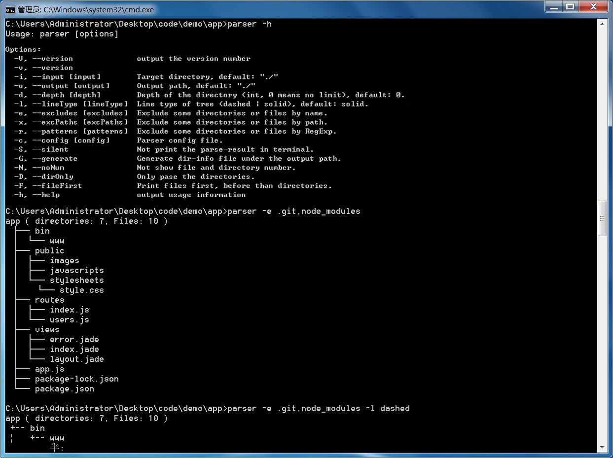

# Dir Parser(文件解析工具)

[](https://www.npmjs.com/package/dir-parser)

> 解析一个文件夹并生成它的结构树

使用其它语言阅读: [English](https://github.com/CN-Tower/dir-parser) | 简体中文

## 快速开始

dir-parser是一个基于nodejs的强大的文件夹分析工具，可以在命令行中使用也可以在javascript代码中应用。有很多实用的参数可以设置，可以帮助你获取格式化的文件夹树和内部信息。

### 示例图片



### 安装 dir-parser

`$ npm install dir-parser -g`

### 打印帮助

`$ parser -h`
```
Usage: parser [options]

Options:
  -V, --version                   output the version number
  -v, --version                   output the version number
  -c, --config [config]           config file, Optional.
  -i, --input <input>             target directory (default: "./")
  -o, --output <output>           output path (default: "./")
  -d, --depth <depth>             depth of a parse process, 0 means no limit (default: 0)
  -l, --lineType <lineType>       line type of tree, "dashed" or "solid" (default: "solid")
  -e, --excludes <excludes..>     exclude some directories or files by name.
  -x, --excPaths <excPaths..>     exclude directories or files by path.
  -p, --patterns <patterns...>    filter directories or files by RegExp.
  -g, --generate [fileName]       generate a dir-info file to the output path, "dir-info.txt" is default.
  -r, --reverse                   reverse the parsed dir-tree nodes.
  -s, --silent                    not show the parsed dir-tree in terminal.
  -f, --fileFirst                 print files first, before directories.
  -F, --fileOnly                  Pase files only.
  -D, --dirOnly                   Pase directories only, and it only takes effect when fileOnly is false.
  -I, --ignores <ignores..>       ignore some directories or files by name.
  -N, --no-dirInfo                hide file and directory number info on the result top.
  --paths <paths..>               filter directories or files by path.
  --includes <includes..>         filter directories or files by name.
  --excPatterns <excPatterns...>  exclude directories or files by RegExp.
  -h, --help                      output usage information
```

### 解析文件夹

`$ cd your/demo/app`<br>
`$ parser`
```
app ( directories: 7, Files: 9 )
 ├─ bin
 │ └─ www
 ├─ public
 │ ├─ images
 │ ├─ javascripts
 │ └─ stylesheets
 │   └─ style.css
 ├─ routes
 │ ├─ index.js
 │ └─ users.js
 ├─ views
 │ ├─ error.pug
 │ ├─ index.pug
 │ └─ layout.pug
 ├─ app.js
 └─ package.json
```

### 根据参数解析文件夹

`$ parser -d 1`
```
app ( directories: 4, Files: 2 )
 ├─ bin
 ├─ public
 ├─ routes
 ├─ views
 ├─ app.js
 └─ package.json
```

`$ parser -l dashed -f`
```
app ( directories: 7, Files: 9 )
 +-- app.js
 +-- package.json
 +-- bin
 ¦   +-- www
 +-- public
 ¦   +-- images
 ¦   +-- javascripts
 ¦   +-- stylesheets
 ¦       +-- style.css
 +-- routes
 ¦   +-- index.js
 ¦   +-- users.js
 +-- views
     +-- error.pug
     +-- index.pug
     +-- layout.pug
```

`$ parser -e bin,public -Ng`<br>
`$ cat dir-info.txt`
```
app
 ├─ routes
 │ ├─ index.js
 │ └─ users.js
 ├─ views
 │ ├─ error.jade
 │ ├─ index.jade
 │ └─ layout.jade
 ├─ app.js
 └─ package.json
```

### 推荐用法

用例一：
*There should no white space in the excludes series!*<br>
`$ parser -e .git,node_modules -x bin/www`

用例二：
*There should no white space in the excludes Array!*<br>
`$ parser -e ['.git','node_modules']  -x ['bin/www']`

用例三：
*Parse by a config file*<br>
`$ vi parser.conf.json`
```
{
  "fileFirst": false,
  "noNum": false,
  "silent": false,
  "generate": true,
  "directory": "your/demo/app",
  "output": "your/output/dir",
  "excludes": [ ".git", "node_modules" ]
}
```
`$ parser -c ./parser.conf.json`

### 在JavaScript代码中使用 dir-parser

#### 接口
```
/**
 * Main Function
 */
parser(dirPath: string, options: Options): Promise<Parsed>

/**
 *Options
 */
interface options {             
  depth?: number;
  reverse?: boolean;
  fileFirst?: boolean;
  fileOnly?: boolean;
  dirOnly?: boolean;
  getFiles?: boolean;
  getChildren?: boolean;
  dirTree?: boolean;             // default: true
  dirInfo?: boolean;             // default: true
  lineType?: 'solid' | 'dashed'; // default: 'solid'
  excludes?: Array<string>;      // eg: [ '.git', 'node_modules', '.idea' ];
  excPaths?: Array<string>;      // eg: [ 'src/app' ];
  excPatterns?: Array<string>;   // eg: [ 'src/*.js ]';
  ignores: Array<string>;        // eg: [ 'public' ];
  includes: Array<string>;       // eg: [ 'app.js' ];
  paths?: Array<string>;         // eg: [ 'src/public' ];
  patterns?: Array<string>;      // eg: [ '*.js ]';
}

/**
 * Parse result
 */
interface Parsed extends DirInfo {
  dirTree: string;
  children: Array<DirInfo | FileInfo>
  files: Array<FileInfo>
}

/**
 * Directory Info
 */
interface DirInfo {
  name: string;
  type: 'directory';
  size: number;
  size_kb: number;
  path: string;
  absPath: string;
  dir: string;
  absDir: string;
  dirNum: number;
  fileNum: number;
  children: Array<DirInfo | FileInfo>
}

/**
 *File Info
 */
interface FileInfo {
  name: string;
  base: string;
  ext: string;
  type: 'file';
  size: number;
  size_kb: number;
  path: string;
  absPath: string;
  dir: string;
  absDir: string;
}
```
#### 在JavaScript中使用
`$ npm install dir-parser funclib`

##### 导入依赖
`$ vi test.js`
```
const fn = require('funclib');
const parser = require('dir-parser');
// excludes list
const excludes = ['.git', 'node_modules', 'dir-info.txt', 'package-lock.json'];
```

##### 生成结构树
`$ vi test.js`
```
parser('./', {
  excludes: excludes,
  // lineType: 'dashed',
  // fileFirst: true,
}).then(parsed => {
  fn.log(parsed.dirTree, '# parsed.dirTree');

  // fn.log(fn.pick(parsed, prop => prop !== 'dirTree'), '# parsed result info');
  // fn.log(parsed.children, '# parsed.children');
  // fn.log(parsed.files, '# parsed.files');
});
```
*调用:* `$ node test.js`
```
==================================================================
                  [17:06:57] # parsed.dirTree
------------------------------------------------------------------
dir-parser ( directories: 8, Files: 30 )
 ├─ bin
 │ └─ parser.js
 ├─ node_modules
 │ ├─ commander
 │ │ ├─ typings
 │ │ │ └─ index.d.ts
 │ │ ├─ CHANGELOG.md
 │ │ ├─ index.js
 │ │ ├─ LICENSE
 │ │ ├─ package.json
 │ │ └─ Readme.md
 │ ├─ funclib
 │ │ ├─ funclib.core.js
 │ │ ├─ funclib.js
 │ │ ├─ funclib.min.js
 │ │ ├─ index.d.ts
 │ │ ├─ index.js
 │ │ ├─ package.json
 │ │ └─ README.md
 │ └─ progress
 │   ├─ lib
 │   │ └─ node-progress.js
 │   ├─ CHANGELOG.md
 │   ├─ index.js
 │   ├─ LICENSE
 │   ├─ Makefile
 │   ├─ package.json
 │   └─ Readme.md
 ├─ src
 │ ├─ base.js
 │ └─ dir-parser.js
 ├─ .gitignore
 ├─ dir-parser.png
 ├─ index.js
 ├─ package.json
 ├─ parser.conf.json
 ├─ README.md
 └─ test.js
==================================================================
```
##### 获取解析结果
`$ vi test.js`
```
parser('./', {
  excludes: excludes,
  // lineType: 'dashed',
  // fileFirst: true,
}).then(parsed => {
  fn.log(fn.pick(parsed, prop => prop !== 'dirTree'), '# parsed result info');
  
  // fn.log(parsed.dirTree, '# parsed.dirTree');
  // fn.log(parsed.children, '# parsed.children');
  // fn.log(parsed.files, '# parsed.files');
});
```
*Execute example:* `$ node test.js`
```
==================================================================
                [17:06:57] # parsed result info
------------------------------------------------------------------
{
  "name": "dir-parser",
  "type": "directory",
  "path": "./",
  "absPath": "E:\\work\\code\\dir-parser",
  "dir": ".",
  "absDir": "E:\\work\\code",
  "dirNum": 8,
  "fileNum": 30
}
==================================================================
```
##### 获取文件信息对象
`$ vi test.js`
```
parser('./', {
  excludes: excludes,
  getFiles: true,    // Default is false, If true, returns will conatins an array of all subfiles's info;
  getChildren: true, // Default is false, If true, returns will conatins an object of all children's info;
  dirTree: false     // Default is true, returns will conatins a tree of the directory;
}).then(parsed => {
  fn.log(parsed.children, '# parsed.children');
  // fn.log(parsed.files, '# parsed.files');
});
```
*调用:* `$ node test.js`
```
==================================================================
                  [17:06:57] # parsed.children
------------------------------------------------------------------
[
  {
    "name": "bin",
    "type": "directory",
    "size": 2920,
    "size_kb": "2.85kb",
    "path": "bin",
    "absPath": "E:\\work\\code\\dir-parser\\bin",
    "dir": ".",
    "absDir": "E:\\work\\code\\dir-parser",
    "dirNum": 0,
    "fileNum": 1,
    "children": [
      {
        "name": "parser.js",
        "base": "parser",
        "ext": ".js",
        "type": "file",
        "size": 2920,
        "size_kb": "2.85kb",
        "path": "bin\\parser.js",
        "absPath": "E:\\work\\code\\dir-parser\\bin\\parser.js",
        "dir": "bin",
        "absDir": "E:\\work\\code\\dir-parser\\bin"
      }
    ]
  },
  {
    "name": "src",
    "type": "directory",
    "size": 6488,
    "size_kb": "6.34kb",
    "path": "src",
    "absPath": "E:\\work\\code\\dir-parser\\src",
    "dir": ".",
    "absDir": "E:\\work\\code\\dir-parser",
    "dirNum": 0,
    "fileNum": 2,
    "children": [
      {
        "name": "base.js",
        "base": "base",
        "ext": ".js",
        "type": "file",
        "size": 1038,
        "size_kb": "1.01kb",
        "path": "src\\base.js",
        "absPath": "E:\\work\\code\\dir-parser\\src\\base.js",
        "dir": "src",
        "absDir": "E:\\work\\code\\dir-parser\\src"
      },
      {
        "name": "dir-parser.js",
        "base": "dir-parser",
        "ext": ".js",
        "type": "file",
        "size": 5450,
        "size_kb": "5.32kb",
        "path": "src\\dir-parser.js",
        "absPath": "E:\\work\\code\\dir-parser\\src\\dir-parser.js",
        "dir": "src",
        "absDir": "E:\\work\\code\\dir-parser\\src"
      }
    ]
  },
  {
    "name": ".gitignore",
    "base": ".gitignore",
    "ext": "",
    "type": "file",
    "size": 34,
    "size_kb": "0.03kb",
    "path": ".gitignore",
    "absPath": "E:\\work\\code\\dir-parser\\.gitignore",
    "dir": "",
    "absDir": "E:\\work\\code\\dir-parser"
  },
  {
    "name": "dir-parser.png",
    "base": "dir-parser",
    "ext": ".png",
    "type": "file",
    "size": 76316,
    "size_kb": "74.53kb",
    "path": "dir-parser.png",
    "absPath": "E:\\work\\code\\dir-parser\\dir-parser.png",
    "dir": "",
    "absDir": "E:\\work\\code\\dir-parser"
  },
  {
    "name": "index.js",
    "base": "index",
    "ext": ".js",
    "type": "file",
    "size": 45,
    "size_kb": "0.04kb",
    "path": "index.js",
    "absPath": "E:\\work\\code\\dir-parser\\index.js",
    "dir": "",
    "absDir": "E:\\work\\code\\dir-parser"
  },
  {
    "name": "package.json",
    "base": "package",
    "ext": ".json",
    "type": "file",
    "size": 732,
    "size_kb": "0.71kb",
    "path": "package.json",
    "absPath": "E:\\work\\code\\dir-parser\\package.json",
    "dir": "",
    "absDir": "E:\\work\\code\\dir-parser"
  },
  {
    "name": "parser.conf.json",
    "base": "parser.conf",
    "ext": ".json",
    "type": "file",
    "size": 111,
    "size_kb": "0.11kb",
    "path": "parser.conf.json",
    "absPath": "E:\\work\\code\\dir-parser\\parser.conf.json",
    "dir": "",
    "absDir": "E:\\work\\code\\dir-parser"
  },
  {
    "name": "README.md",
    "base": "README",
    "ext": ".md",
    "type": "file",
    "size": 11467,
    "size_kb": "11.2kb",
    "path": "README.md",
    "absPath": "E:\\work\\code\\dir-parser\\README.md",
    "dir": "",
    "absDir": "E:\\work\\code\\dir-parser"
  },
  {
    "name": "test.js",
    "base": "test",
    "ext": ".js",
    "type": "file",
    "size": 1196,
    "size_kb": "1.17kb",
    "path": "test.js",
    "absPath": "E:\\work\\code\\dir-parser\\test.js",
    "dir": "",
    "absDir": "E:\\work\\code\\dir-parser"
  }
]
==================================================================
```
##### Get directory json
`$ vi test.js`
```
parser('./', {
  excludes: excludes,
  getFiles: true,
  getChildren: true,
  dirTree: false
}).then(parsed => {
  // fn.log(parsed.children, '# parsed.children');
  fn.log(parsed.files, '# parsed.files');
});
```
*Execute example:* `$ node test.js`
```
==================================================================
                   [17:06:57] # parsed.files
------------------------------------------------------------------
[
  {
    "name": "parser.js",
    "base": "parser",
    "ext": ".js",
    "type": "file",
    "size": 2920,
    "size_kb": "2.85kb",
    "path": "bin\\parser.js",
    "absPath": "E:\\work\\code\\dir-parser\\bin\\parser.js",
    "dir": "bin",
    "absDir": "E:\\work\\code\\dir-parser\\bin"
  },
  {
    "name": "base.js",
    "base": "base",
    "ext": ".js",
    "type": "file",
    "size": 1038,
    "size_kb": "1.01kb",
    "path": "src\\base.js",
    "absPath": "E:\\work\\code\\dir-parser\\src\\base.js",
    "dir": "src",
    "absDir": "E:\\work\\code\\dir-parser\\src"
  },
  {
    "name": "dir-parser.js",
    "base": "dir-parser",
    "ext": ".js",
    "type": "file",
    "size": 5450,
    "size_kb": "5.32kb",
    "path": "src\\dir-parser.js",
    "absPath": "E:\\work\\code\\dir-parser\\src\\dir-parser.js",
    "dir": "src",
    "absDir": "E:\\work\\code\\dir-parser\\src"
  },
  {
    "name": ".gitignore",
    "base": ".gitignore",
    "ext": "",
    "type": "file",
    "size": 34,
    "size_kb": "0.03kb",
    "path": ".gitignore",
    "absPath": "E:\\work\\code\\dir-parser\\.gitignore",
    "dir": "",
    "absDir": "E:\\work\\code\\dir-parser"
  },
  {
    "name": "dir-parser.png",
    "base": "dir-parser",
    "ext": ".png",
    "type": "file",
    "size": 76316,
    "size_kb": "74.53kb",
    "path": "dir-parser.png",
    "absPath": "E:\\work\\code\\dir-parser\\dir-parser.png",
    "dir": "",
    "absDir": "E:\\work\\code\\dir-parser"
  },
  {
    "name": "index.js",
    "base": "index",
    "ext": ".js",
    "type": "file",
    "size": 45,
    "size_kb": "0.04kb",
    "path": "index.js",
    "absPath": "E:\\work\\code\\dir-parser\\index.js",
    "dir": "",
    "absDir": "E:\\work\\code\\dir-parser"
  },
  {
    "name": "package.json",
    "base": "package",
    "ext": ".json",
    "type": "file",
    "size": 732,
    "size_kb": "0.71kb",
    "path": "package.json",
    "absPath": "E:\\work\\code\\dir-parser\\package.json",
    "dir": "",
    "absDir": "E:\\work\\code\\dir-parser"
  },
  {
    "name": "parser.conf.json",
    "base": "parser.conf",
    "ext": ".json",
    "type": "file",
    "size": 111,
    "size_kb": "0.11kb",
    "path": "parser.conf.json",
    "absPath": "E:\\work\\code\\dir-parser\\parser.conf.json",
    "dir": "",
    "absDir": "E:\\work\\code\\dir-parser"
  },
  {
    "name": "README.md",
    "base": "README",
    "ext": ".md",
    "type": "file",
    "size": 11467,
    "size_kb": "11.2kb",
    "path": "README.md",
    "absPath": "E:\\work\\code\\dir-parser\\README.md",
    "dir": "",
    "absDir": "E:\\work\\code\\dir-parser"
  },
  {
    "name": "test.js",
    "base": "test",
    "ext": ".js",
    "type": "file",
    "size": 1196,
    "size_kb": "1.17kb",
    "path": "test.js",
    "absPath": "E:\\work\\code\\dir-parser\\test.js",
    "dir": "",
    "absDir": "E:\\work\\code\\dir-parser"
  }
]
==================================================================
```
